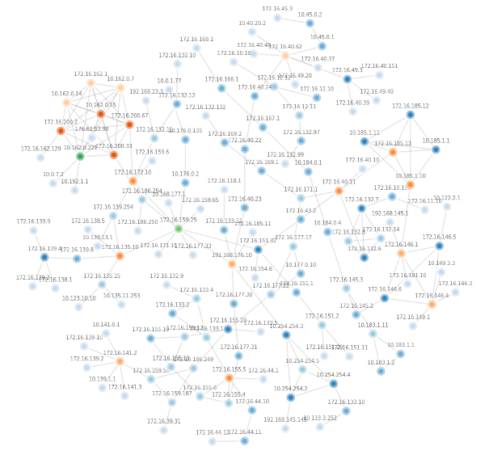
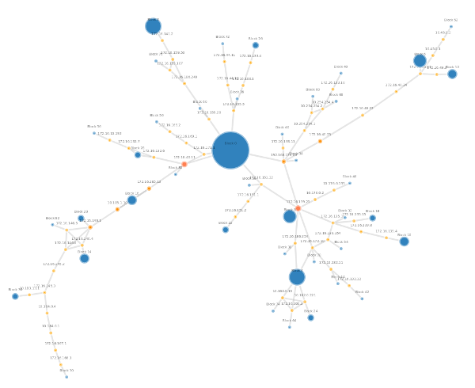

# netjson-robustness-analyser
A simple library to manipulate netjson graphs in order to make some robustness analysis.

The library contains one `ParsedGraph()` class initiated with a NetJSON graph. Objects have currently only one method, the `condensate_graph()`  method which returns a block-cut tree representation of the graph. This representation allows to spot the cutpoints of the network, that is, nodes that if removed partition the network. An example of the difference is given by the ninux network topology,  as rendered by the [netjsongraph.js](https://github.com/netCommonsEU/netjsongraph.js/tree/robustness_graph) library. The original view is the follwing one: 



while the condensed view is:



which clearly helps spotting the critical nodes in the topology.

The simple main can be used as 

```main.py network.json``` 

this will output a new condensed NetJSON.